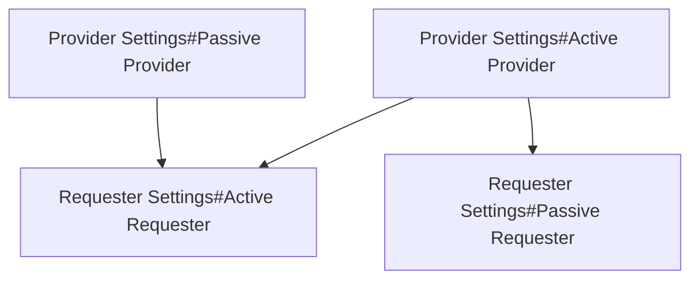

#WIP
The flow of items/fluids from providers to requesters is as follows:

If you are looking to emulate Factorio's logistic network system:

| Factorio Logistic Chest | Provider Setting | Requester Setting |
| -- | -- | -- |
| Storage | [[Provider Settings#Passive Provider\|Passive Provider]] | [[Requester Settings#Passive Requester\|Passive Requester]] |
| Buffer | [[Provider Settings#Passive Provider\|Passive Provider]] | [[Requester Settings#Active Requester\|Active Requester]] |
| Passive Provider | [[Provider Settings#Passive Provider\|Passive Provider]] | None |
| Active Provider | [[Provider Settings#Active Provider\|Active Provider]] | None |
| Requester | None | [[Requester Settings#Active Requester\|Active Requester]] |
